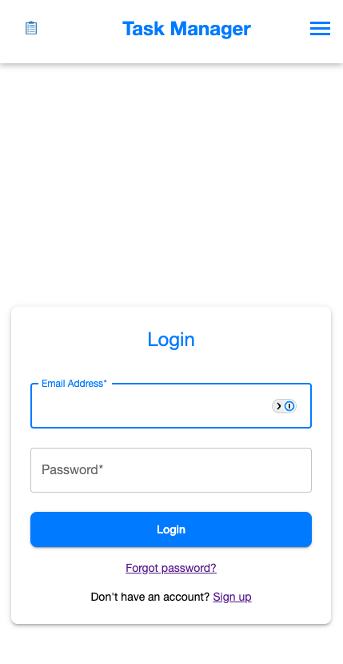

# TaskFlow — Task & Team Management App

TaskFlow is a responsive web application for managing personal and team-based tasks. Built with a modern tech stack (React + Ruby on Rails), it supports seamless collaboration across teams and projects, with an emphasis on clarity, speed, and ease of use.

---

## ✨ Features

- ✅ Create personal tasks
- 🧠 Build and manage teams
- 📁 Create projects under each team
- 📝 Add tasks to projects
- 👥 Add users to teams and assign tasks
- 🔍 View user profiles, including:
  - Assigned tasks
  - Completed tasks
  - Overdue tasks
- ✏️ Full CRUD functionality for everything (projects, tasks, teams, users)

---

## 🧰 Tech Stack

### Frontend
- [React](https://reactjs.org/) (with [Vite](https://vitejs.dev/))
- [TypeScript](https://www.typescriptlang.org/)
- [Material UI](https://mui.com/)
- [Styled Components](https://styled-components.com/)
- React Context API for state management

### Backend
- [Ruby on Rails](https://rubyonrails.org/)
- [SQLite](https://www.sqlite.org/)
- [SendGrid](https://sendgrid.com/) for transactional emails
- JWT Authentication via **HttpOnly cookies**

---

## 🔐 Authentication

The app uses secure JWT-based authentication, stored in **HttpOnly cookies**, to prevent XSS access from the frontend. Protected endpoints are guarded with a custom `authenticate_user!` method in the Rails API.

---

## 📸 Screenshots

<!-- Add screenshots here -->





---

## 🚀 Getting Started

### Backend (Rails API)

```bash
bundle install
rails db:migrate
rails server
```

### 🛠️ Folder Structure

```plaintext
/               # Root directory  
  /client       # React + Vite frontend  
  /server       # Ruby on Rails API  
```

### 📬 Contact

Built by [Omar Taha](https://www.linkedin.com/in/omar-taha-1374a4112/).